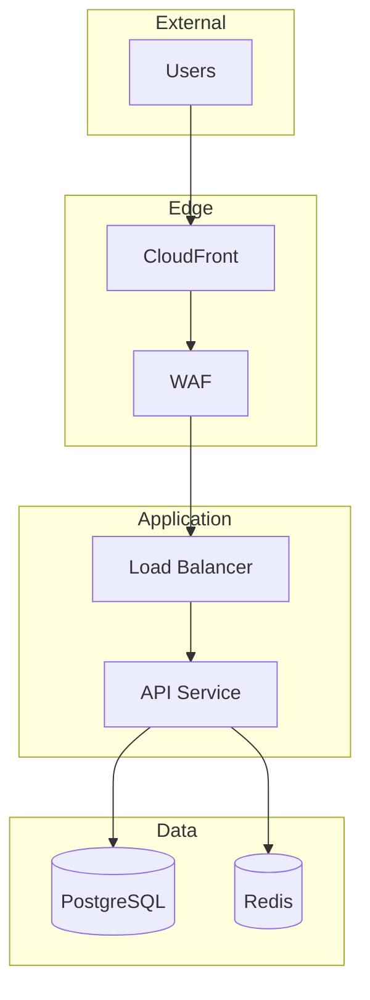

# Technical Writing Skills

> **NIST CSF 2.0 Alignment**: GOVERN Function - Policy & Organizational Communication
> Supports documentation of security policies, procedures, and organizational communications

## Documentation Hierarchy ⇒ GV.OC-04, GV.OC-05

```
┌─────────────────────────────────────────────────────────────────┐
│                    Documentation Pyramid                        │
├─────────────────────────────────────────────────────────────────┤
│                                                                 │
│                         ┌─────────┐                             │
│                         │Executive│  Business impact, risks    │
│                         │ Summary │  1 page ⇒ GV.OC-04         │
│                         └────┬────┘                             │
│                    ┌─────────┴─────────┐                       │
│                    │   Architecture    │  System design        │
│                    │   Documentation   │  10-20 pages          │
│                    └─────────┬─────────┘  ⇒ GV.PO-02           │
│              ┌───────────────┴───────────────┐                 │
│              │      Operational Docs         │  Runbooks       │
│              │      (How to operate)         │  Per-service    │
│              └───────────────┬───────────────┘  ⇒ RS.MA        │
│        ┌─────────────────────┴─────────────────────┐           │
│        │            Developer Docs                  │  APIs    │
│        │            (How to build)                  │  SDKs    │
│        └─────────────────────┬─────────────────────┘           │
│  ┌───────────────────────────┴───────────────────────────┐     │
│  │                    Reference Docs                      │     │
│  │                    (How things work)                   │     │
│  └────────────────────────────────────────────────────────┘     │
│                                                                 │
└─────────────────────────────────────────────────────────────────┘
```

## Architecture Decision Records ⇒ GV.PO-02, GV.RM-05

### ADR Template
```markdown
# ADR-001: [Title]

## Status
[Proposed | Accepted | Deprecated | Superseded by ADR-XXX]

## Date
2024-01-15

## Context ⇒ GV.RM-01 (Risk context)
[What is the issue that we're seeing that is motivating this decision?]

## Decision ⇒ GV.PO-02 (Policy decision)
[What is the change that we're proposing/implementing?]

## Rationale ⇒ GV.RM-05 (Risk-informed decision)
[Why did we choose this option over alternatives?]

## Consequences

### Positive
- [Benefit 1]
- [Benefit 2]

### Negative
- [Trade-off 1]
- [Trade-off 2]

### Risks ⇒ GV.RM-02 (Risk documentation)
- [Risk 1 and mitigation]

## Alternatives Considered ⇒ GV.RM-05

### Option A: [Name]
- Pros: ...
- Cons: ...
- Why not chosen: ...

### Option B: [Name]
- Pros: ...
- Cons: ...
- Why not chosen: ...

## References
- [Link to relevant docs]
- [Link to RFC/design doc]

## NIST CSF Alignment
- Primary Function: [GOVERN/IDENTIFY/PROTECT/DETECT/RESPOND/RECOVER]
- Categories Addressed: [List relevant categories]
```

### ADR Index ⇒ GV.PO-02 (Policy inventory)
```markdown
# Architecture Decision Records

| ADR | Title | Status | Date | NIST CSF |
|-----|-------|--------|------|----------|
| [001](adr/001-container-orchestration.md) | Container Orchestration | Accepted | 2024-01 | PR.PS |
| [002](adr/002-database-selection.md) | Database Selection | Accepted | 2024-01 | PR.DS |
| [003](adr/003-authentication.md) | Authentication Strategy | Proposed | 2024-02 | PR.AA |
```

## Runbook Template ⇒ RS.MA-01, RS.MA-02

```markdown
# Runbook: [Service/Issue Name]

## Overview ⇒ RS.MA-01 (Incident procedures)
Brief description of what this runbook covers.

## When to Use
- Alert: `AlertName` ⇒ DE.AE-02 (Alert correlation)
- Symptom: User-visible impact
- SLO Impact: Which SLO is at risk ⇒ GV.OV-03

## Prerequisites ⇒ PR.AA-05 (Access management)
- [ ] Access to production environment
- [ ] Required permissions/roles
- [ ] Tools needed

## Quick Diagnosis (< 5 minutes) ⇒ RS.AN-03

### Step 1: Check Service Health
```bash
kubectl get pods -n namespace -l app=service
```
Expected: All pods Running

### Step 2: Check Recent Changes ⇒ PR.PS-02 (Change tracking)
```bash
kubectl rollout history deployment/service -n namespace
```

### Step 3: Check Dependencies
- [ ] Database: [Dashboard Link]
- [ ] Cache: [Dashboard Link]

## Common Causes and Fixes ⇒ RS.MI-01, RS.MI-02

### Cause 1: [Name]
**Symptoms**: What you'll see
**Diagnosis**:
```bash
# Command to diagnose
```
**Fix**:
```bash
# Command to fix
```

### Cause 2: [Name]
**Symptoms**: What you'll see
**Fix**:
```bash
# Command to fix
```

## Escalation ⇒ RS.CO-02 (Communication)
If not resolved within [time]:
1. Page: @team-oncall
2. Slack: #incident-channel
3. Bridge: [Meeting link]

## Post-Incident ⇒ RS.IM-02 (Lessons learned)
- [ ] Update this runbook if new cause found
- [ ] Create ticket for permanent fix
- [ ] Schedule postmortem if applicable
```

## API Documentation (OpenAPI) ⇒ GV.PO-02

```yaml
openapi: 3.1.0
info:
  title: Service API
  version: 1.0.0
  description: |
    API description with usage guidelines.

    ## Authentication ⇒ PR.AA-01
    All endpoints require Bearer token authentication.

    ## Rate Limiting ⇒ PR.IR-01
    - 1000 requests/minute per API key
    - 429 response when exceeded

servers:
  - url: https://api.company.com/v1
    description: Production

paths:
  /resources:
    get:
      summary: List resources
      description: |
        Returns paginated list of resources.
        Supports filtering and sorting.
      operationId: listResources
      tags:
        - Resources
      security:  # ⇒ PR.AA-01
        - bearerAuth: []
      parameters:
        - name: page
          in: query
          schema:
            type: integer
            default: 1
        - name: limit
          in: query
          schema:
            type: integer
            default: 20
            maximum: 100
      responses:
        '200':
          description: Successful response
          content:
            application/json:
              schema:
                $ref: '#/components/schemas/ResourceList'
        '401':
          $ref: '#/components/responses/Unauthorized'

components:
  schemas:
    Resource:
      type: object
      required:
        - id
        - name
      properties:
        id:
          type: string
          format: uuid
        name:
          type: string
          minLength: 1
          maxLength: 255
        created_at:
          type: string
          format: date-time

  responses:
    Unauthorized:  # ⇒ PR.AA-01 (Authentication required)
      description: Authentication required
      content:
        application/json:
          schema:
            $ref: '#/components/schemas/Error'

  securitySchemes:  # ⇒ PR.AA-01
    bearerAuth:
      type: http
      scheme: bearer
      bearerFormat: JWT
```

## System Architecture Documentation ⇒ GV.PO-02, ID.AM

```markdown
# [System Name] Architecture

## Overview ⇒ GV.OC-05 (Stakeholder communication)
[2-3 sentences describing what this system does and why it exists]

## Architecture Diagram ⇒ ID.AM-03 (Data flows)


## Components ⇒ ID.AM-02 (Asset inventory)

### API Service
- **Purpose**: Handles HTTP requests
- **Technology**: Go, Kubernetes
- **Scaling**: HPA (min: 3, max: 50)
- **Repository**: [link]
- **Security Controls**: ⇒ PR.PS-01

## Data Flow ⇒ ID.AM-03

### Request Flow
1. User request → CloudFront ⇒ PR.IR-04 (CDN protection)
2. CloudFront → WAF ⇒ PR.IR-04 (WAF filtering)
3. WAF → ALB ⇒ PR.IR-01 (Load balancing)
4. ALB → API ⇒ PR.DS-02 (TLS encryption)
5. API → Database ⇒ PR.DS-01 (Data at rest)

## Security Controls ⇒ PR.AA, PR.DS
- **Authentication**: JWT via Auth0 ⇒ PR.AA-01
- **Authorization**: RBAC ⇒ PR.AA-05
- **Encryption**: TLS 1.3, KMS at rest ⇒ PR.DS-01, PR.DS-02

## Monitoring ⇒ DE.CM
- **Metrics**: Prometheus → Grafana ⇒ DE.CM-01
- **Logs**: Loki ⇒ DE.CM-09
- **Alerts**: [PagerDuty link] ⇒ DE.AE-02
```

## Documentation Standards ⇒ GV.PO-02

### Style Guide
```yaml
# ⇒ GV.PO-02: Documentation standards
writing_style:
  voice: Active, not passive
  tense: Present for current state, imperative for instructions
  length: Concise but complete

formatting:
  headings: Title Case for H1/H2, Sentence case for H3+
  code_blocks: Always specify language
  links: Descriptive text, not "click here"
  lists: Parallel structure
  nist_references: Use ⇒ notation for CSF mappings

structure:
  overview_first: Start with what and why
  progressive_disclosure: Basic → Advanced
  examples: Include for every concept
  troubleshooting: Common issues at the end
  security_context: Include NIST CSF references where applicable
```

### Documentation Repository Structure ⇒ GV.PO-02
```
docs/
├── README.md              # Entry point
├── architecture/
│   ├── overview.md        # ⇒ GV.OC-05
│   ├── diagrams/
│   │   └── system.mmd
│   └── decisions/
│       └── adr/           # ⇒ GV.PO-02
├── operations/
│   ├── runbooks/          # ⇒ RS.MA-01
│   └── playbooks/         # ⇒ RS.MA-02
├── development/
│   ├── getting-started.md
│   ├── api/
│   │   └── openapi.yaml   # ⇒ GV.PO-02
│   └── contributing.md
├── security/
│   ├── threat-model.md    # ⇒ ID.RA-03
│   ├── incident-response.md  # ⇒ RS.MA-01
│   └── nist-csf-mapping.md   # ⇒ GV.PO-01
└── mkdocs.yml
```

### MkDocs Configuration
```yaml
site_name: Platform Documentation
theme:
  name: material
  features:
    - navigation.tabs
    - navigation.sections
    - search.highlight

nav:
  - Home: index.md
  - Architecture:
    - Overview: architecture/overview.md
    - Decisions: architecture/decisions/index.md
  - Operations:
    - Runbooks: operations/runbooks/index.md
  - Development:
    - Getting Started: development/getting-started.md
    - API Reference: development/api/index.md
  - Security:  # ⇒ GV.OC-05 (Security documentation)
    - Threat Model: security/threat-model.md
    - NIST CSF Mapping: security/nist-csf-mapping.md

plugins:
  - search
  - mermaid2
  - git-revision-date
```

## Security Documentation Templates ⇒ GV.PO-02

### Threat Model Document ⇒ ID.RA-03
```markdown
# Threat Model: [System Name]

## System Overview
[Brief description]

## Assets ⇒ ID.AM-05 (Critical assets)
| Asset | Classification | Owner |
|-------|----------------|-------|
| Customer PII | Confidential | Data Team |
| API Keys | Secret | Platform Team |

## Trust Boundaries ⇒ ID.AM-03
[Diagram showing trust boundaries]

## Threats (STRIDE) ⇒ ID.RA-03
| Threat | STRIDE | MITRE ATT&CK | Mitigation |
|--------|--------|--------------|------------|
| SQL Injection | Tampering | T1190 | Parameterized queries |
| Session Hijacking | Spoofing | T1539 | Secure cookies |

## Risk Assessment ⇒ ID.RA-05
[Risk scoring and prioritization]
```

### Incident Response Playbook ⇒ RS.MA-01
```markdown
# Incident Response: [Incident Type]

## Classification ⇒ RS.MA-01
- Severity: [SEV1-4]
- Category: [Data breach, Service outage, etc.]

## Detection ⇒ DE.AE-02
- Alert sources
- Indicators of compromise

## Response Steps ⇒ RS.MA-02
1. Containment
2. Eradication
3. Recovery
4. Post-incident

## Communication ⇒ RS.CO-02
- Internal notifications
- External notifications
- Regulatory requirements
```

## Documentation Review Checklist ⇒ GV.OV-02

| Category | Check | Status | NIST CSF |
|----------|-------|--------|----------|
| **Audience** | Target audience identified | ☐ | GV.OC-05 |
| **Audience** | Appropriate level of detail | ☐ | GV.OC-05 |
| **Content** | Accurate and up-to-date | ☐ | GV.OV-02 |
| **Content** | Complete coverage | ☐ | GV.PO-02 |
| **Content** | Examples provided | ☐ | GV.OC-04 |
| **Structure** | Logical organization | ☐ | GV.PO-02 |
| **Structure** | Easy to navigate | ☐ | GV.OC-05 |
| **Style** | Consistent terminology | ☐ | GV.PO-02 |
| **Style** | Clear and concise | ☐ | GV.OC-04 |
| **Technical** | Code examples tested | ☐ | GV.OV-02 |
| **Technical** | Links verified | ☐ | GV.OV-02 |
| **Security** | NIST CSF mappings included | ☐ | GV.PO-01 |
| **Security** | Sensitive info redacted | ☐ | PR.DS-05 |
