# Overall System Architecture

**Version**: 2.0
**Last Updated**: December 2025
**Author**: Evgeniy Gantman
**Status**: Production

## Executive Summary

This document describes the complete payment processing platform architecture deployed on AWS, processing **1M+ transactions daily** with **99.95% uptime** and **PCI DSS Level 1 compliance**.

### Key Metrics
- **Daily Transactions**: 1,000,000+
- **API Requests**: 2.5M/day
- **Services**: 200+ (EKS pods + EC2 instances)
- **Data Protected**: Multi-PB cardholder data
- **Regions**: 2 (EU-West-1 primary, EU-West-2 DR)
- **Accounts**: 15+ AWS accounts (multi-account strategy)
- **Uptime**: 99.95% (payment processing SLA)

## Architecture Overview (Mermaid)

```mermaid
graph TB
    subgraph Internet["🌐 Internet"]
        Customer[Customer Browser/Mobile]
        Merchant[Merchant Portal]
        Partner[Partner API Client]
    end

    subgraph CloudFront["AWS CloudFront + Shield"]
        CF[CloudFront Distribution<br/>DDoS Protection]
    end

    subgraph WAF["AWS WAF"]
        WAFRules[12 Rule Groups<br/>50K+ Attacks Blocked/Month<br/>- SQL Injection<br/>- XSS Prevention<br/>- Card Testing<br/>- Geo-blocking]
    end

    subgraph Production["AWS Account: Production (PCI DSS CDE)"]

        subgraph PublicZone["Public Subnet (DMZ)"]
            ALB[Application Load Balancer<br/>TLS 1.3 Termination<br/>mTLS for Partners]
        end

        subgraph APIGateway["API Gateway Layer"]
            APIGW[AWS API Gateway<br/>120+ Endpoints<br/>JWT Validation<br/>Rate Limiting]
            Lambda[Custom Authorizer<br/>Lambda Function]
        end

        subgraph PrivateSubnetPCI["Private Subnet - PCI CDE Zone"]
            direction LR

            subgraph EKS["EKS Cluster (PCI CDE)"]
                Ingress[Istio Ingress Gateway]

                subgraph PaymentServices["Payment Microservices"]
                    PayAPI[Payment API<br/>Pod Security: Restricted<br/>mTLS via Istio]
                    AuthService[Auth Service<br/>Cognito Integration]
                    TokenService[Tokenization Service<br/>PAN → Token]
                    FraudService[Fraud Detection<br/>ML-based Scoring]
                end

                subgraph SecurityControls["Security Controls"]
                    Falco[Falco Runtime<br/>Container Escape Detection]
                    OPA[OPA Gatekeeper<br/>Policy Enforcement]
                end
            end

            subgraph Database["Database Layer"]
                RDSPrimary[(Aurora PostgreSQL<br/>Primary<br/>Encrypted: KMS<br/>Backup: Daily)]
                RDSReplica[(Read Replica<br/>Cross-Region to DR)]
                Redis[(ElastiCache Redis<br/>Session Store)]
            end

            subgraph Storage["Storage Layer"]
                S3CDE[S3 Bucket: Cardholder Data<br/>SSE-KMS Encrypted<br/>Versioning Enabled<br/>Access Logging]
                KMS[AWS KMS<br/>CMK for PAN Encryption]
            end
        end

        subgraph PrivateSubnetNonPCI["Private Subnet - Non-CDE Zone"]
            subgraph NonPCIServices["Non-PCI Services"]
                Reporting[Reporting API]
                Analytics[Analytics Service]
                Notification[Notification Service]
            end

            subgraph Monitoring["Monitoring & Security"]
                Wazuh[Wazuh Manager<br/>280+ Detection Rules<br/>MITRE ATT&CK Coverage]
                SecOnion[Security Onion<br/>Zeek + Suricata<br/>Network Detection]
                Prometheus[Prometheus<br/>Metrics Collection]
            end
        end
    end

    subgraph LoggingAccount["AWS Account: Security/Logging"]
        CloudTrail[(CloudTrail<br/>All API Calls<br/>S3 Immutable Storage)]
        GuardDuty[GuardDuty<br/>ML Threat Detection]
        SecurityHub[Security Hub<br/>Centralized Findings]
        S3Logs[(S3: Centralized Logs<br/>VPC Flow, ALB, CloudFront)]
    end

    subgraph NetworkAccount["AWS Account: Network Hub"]
        TGW[Transit Gateway<br/>Hub-and-Spoke Topology]
        VPN[Client VPN<br/>Admin Access<br/>MFA Required]
    end

    subgraph DRRegion["DR Region: EU-West-2 (Pilot-Light)"]
        RDSDRReplica[(Aurora Replica<br/>Read-Only<br/>Promote on Failover)]
        S3DRCR[S3 Cross-Region<br/>Replication]
        Route53Health[Route 53<br/>Health Checks<br/>Auto-Failover]
    end

    %% Connections
    Customer --> CF
    Merchant --> CF
    Partner --> CF
    CF --> WAFRules
    WAFRules --> ALB
    ALB --> APIGW
    APIGW --> Lambda
    Lambda -.JWT Validation.-> AuthService
    APIGW --> Ingress
    Ingress --> PayAPI
    Ingress --> AuthService
    PayAPI --> TokenService
    PayAPI --> FraudService
    TokenService --> KMS
    PayAPI --> RDSPrimary
    PayAPI --> Redis
    TokenService --> S3CDE
    RDSPrimary -.Replication.-> RDSReplica
    RDSPrimary -.Async Replication.-> RDSDRReplica
    S3CDE -.Cross-Region Replication.-> S3DRCR

    %% Security Monitoring
    PayAPI -.Logs.-> Wazuh
    EKS -.Audit Logs.-> CloudTrail
    ALB -.Access Logs.-> S3Logs
    Falco -.Alerts.-> Wazuh
    SecOnion -.Network Traffic.-> S3Logs
    GuardDuty -.Findings.-> SecurityHub
    Wazuh -.Alerts.-> SecurityHub

    %% Network
    Production -.Private Link.-> NetworkAccount
    TGW --> Production
    VPN -.Admin Access.-> Production

    %% DR
    Route53Health -.Health Check Failure.-> DRRegion

    %% Styling
    classDef pciCDE fill:#ff6b6b,stroke:#c92a2a,stroke-width:3px,color:#fff
    classDef nonCDE fill:#51cf66,stroke:#2f9e44,stroke-width:2px
    classDef security fill:#ffd43b,stroke:#f08c00,stroke-width:2px
    classDef external fill:#74c0fc,stroke:#1c7ed6,stroke-width:2px

    class PrivateSubnetPCI,EKS,PaymentServices,Database,Storage pciCDE
    class PrivateSubnetNonPCI,NonPCIServices nonCDE
    class Monitoring,SecurityControls,LoggingAccount,GuardDuty,SecurityHub security
    class Internet,CloudFront,WAF external
```



## ASCII Architecture Diagram

```
┌─────────────────────────────────────────────────────────────────────────────────────┐
│                                 🌐 INTERNET                                          │
│  Customer Browsers │ Merchant Portal │ Partner API Clients                          │
└─────────────────────────────────┬───────────────────────────────────────────────────┘
                                  │
                                  │ HTTPS (TLS 1.3)
                                  ▼
┌─────────────────────────────────────────────────────────────────────────────────────┐
│                     AWS CloudFront + Shield (DDoS Protection)                        │
│  ├─ Edge Locations: Global                                                          │
│  ├─ Cache Hit Rate: 70%                                                             │
│  └─ Shield Standard: L3/L4 DDoS mitigation                                          │
└─────────────────────────────────┬───────────────────────────────────────────────────┘
                                  │
                                  ▼
┌─────────────────────────────────────────────────────────────────────────────────────┐
│                              AWS WAF (12 Rule Groups)                                │
│  ├─ OWASP Top 10 Protection    ├─ PAN Regex Detection                              │
│  ├─ SQL Injection Blocking     ├─ Rate Limiting (2K req/5min per IP)               │
│  ├─ XSS Prevention             └─ Geo-blocking (15 countries)                       │
│  └─ Attacks Blocked: 50,000+/month                                                  │
└─────────────────────────────────┬───────────────────────────────────────────────────┘
                                  │
┏━━━━━━━━━━━━━━━━━━━━━━━━━━━━━━━━━┷━━━━━━━━━━━━━━━━━━━━━━━━━━━━━━━━━━━━━━━━━━━━━━━━━┓
┃                    AWS ACCOUNT: PRODUCTION (PCI DSS Level 1)                        ┃
┃                                                                                     ┃
┃  ┌─────────────────────────────────────────────────────────────────────┐          ┃
┃  │  PUBLIC SUBNET (DMZ) - AZ1 & AZ2                                    │          ┃
┃  │  ┌────────────────────────────────────────────┐                     │          ┃
┃  │  │  Application Load Balancer                 │                     │          ┃
┃  │  │  ├─ TLS 1.3 termination                   │                     │          ┃
┃  │  │  ├─ mTLS for partner integrations          │                     │          ┃
┃  │  │  └─ Access logs → S3                       │                     │          ┃
┃  │  └────────────────────┬───────────────────────┘                     │          ┃
┃  └───────────────────────┼──────────────────────────────────────────────          ┃
┃                          │                                                         ┃
┃                          ▼                                                         ┃
┃  ┌────────────────────────────────────────────────────────────────────┐           ┃
┃  │  API GATEWAY LAYER                                                 │           ┃
┃  │  ┌──────────────────────────────────────┐  ┌─────────────────────┐│           ┃
┃  │  │ AWS API Gateway                      │  │ Lambda Authorizer   ││           ┃
┃  │  │ ├─ 120+ REST/GraphQL endpoints      │→ │ JWT Validation      ││           ┃
┃  │  │ ├─ Request validation (JSON Schema) │  │ Cognito integration ││           ┃
┃  │  │ ├─ Rate limiting (tiered)           │  │ IAM policy return   ││           ┃
┃  │  │ └─ Usage plans: Free/Std/Premium    │  └─────────────────────┘│           ┃
┃  │  └──────────────────┬───────────────────────────────────────────────           ┃
┃  └─────────────────────┼──────────────────────────────────────────────           ┃
┃                        │                                                           ┃
┃  ╔═════════════════════╧═══════════════════════════════════════════════════════╗  ┃
┃  ║          PRIVATE SUBNET - PCI DSS CARDHOLDER DATA ENVIRONMENT (CDE)          ║  ┃
┃  ║                                                                               ║  ┃
┃  ║  ┌──────────────────────────────────────────────────────────────────────┐   ║  ┃
┃  ║  │  EKS CLUSTER (Kubernetes 1.28)                                       │   ║  ┃
┃  ║  │                                                                       │   ║  ┃
┃  ║  │  ┌─────────────────────────────────────────────────────────────┐    │   ║  ┃
┃  ║  │  │  Istio Service Mesh (mTLS enabled)                          │    │   ║  ┃
┃  ║  │  │  Ingress Gateway ↓                                           │    │   ║  ┃
┃  ║  │  └─────────────────────────────────────────────────────────────┘    │   ║  ┃
┃  ║  │                                                                       │   ║  ┃
┃  ║  │  [Payment Services Namespace]                                        │   ║  ┃
┃  ║  │  ┌──────────────┐  ┌───────────────┐  ┌──────────────────────┐    │   ║  ┃
┃  ║  │  │ Payment API  │  │ Auth Service  │  │ Tokenization Service │    │   ║  ┃
┃  ║  │  │ ├─ PSS:      │  │ ├─ Cognito    │  │ ├─ PAN → Token      │    │   ║  ┃
┃  ║  │  │ │  Restricted│  │ │  Integration │  │ ├─ AES-256-GCM     │    │   ║  ┃
┃  ║  │  │ ├─ mTLS: ✓   │  │ ├─ JWT issue  │  │ └─ KMS integration  │    │   ║  ┃
┃  ║  │  │ └─ Replicas:3│  │ └─ MFA enforce│  └─────────┬────────────┘    │   ║  ┃
┃  ║  │  └──────┬───────┘  └───────────────┘            │                 │   ║  ┃
┃  ║  │         │                                        │                 │   ║  ┃
┃  ║  │         │  ┌──────────────────┐  ┌──────────────▼──────────────┐  │   ║  ┃
┃  ║  │         │  │ Fraud Detection  │  │ Card Data Vault (Pod)       │  │   ║  ┃
┃  ║  │         └─→│ ├─ ML Scoring    │  │ ├─ Encrypted PAN storage    │  │   ║  ┃
┃  ║  │            │ └─ Rules Engine  │  │ └─ Tokenization processing  │  │   ║  ┃
┃  ║  │            └──────────────────┘  └─────────────────────────────┘  │   ║  ┃
┃  ║  │                                                                       │   ║  ┃
┃  ║  │  [Security Controls]                                                 │   ║  ┃
┃  ║  │  ┌────────────────┐  ┌─────────────────┐  ┌──────────────────┐    │   ║  ┃
┃  ║  │  │ Falco Runtime  │  │ OPA Gatekeeper  │  │ Network Policies │    │   ║  ┃
┃  ║  │  │ Container      │  │ Admission       │  │ Default: Deny    │    │   ║  ┃
┃  ║  │  │ Escape Detect  │  │ Control         │  │ Micro-segmentation│   │   ║  ┃
┃  ║  │  └────────────────┘  └─────────────────┘  └──────────────────┘    │   ║  ┃
┃  ║  └───────────────────────────────┬────────────────────────────────────┘   ║  ┃
┃  ║                                  │                                         ║  ┃
┃  ║                                  ▼                                         ║  ┃
┃  ║  ┌────────────────────────────────────────────────────────────────────┐   ║  ┃
┃  ║  │  DATABASE LAYER                                                    │   ║  ┃
┃  ║  │  ┌─────────────────────┐     ┌────────────────────┐               │   ║  ┃
┃  ║  │  │ Aurora PostgreSQL   │────→│ Read Replica       │               │   ║  ┃
┃  ║  │  │ (Primary)           │     │ (Analytics/Reports)│               │   ║  ┃
┃  ║  │  │ ├─ Multi-AZ         │     └────────────────────┘               │   ║  ┃
┃  ║  │  │ ├─ Encrypted: KMS   │     ┌────────────────────┐               │   ║  ┃
┃  ║  │  │ ├─ Backup: Daily    │────→│ Cross-Region       │               │   ║  ┃
┃  ║  │  │ └─ PITR: 35 days    │     │ Replica (DR)       │               │   ║  ┃
┃  ║  │  └─────────────────────┘     └────────────────────┘               │   ║  ┃
┃  ║  │                                                                     │   ║  ┃
┃  ║  │  ┌─────────────────────┐                                           │   ║  ┃
┃  ║  │  │ ElastiCache Redis   │                                           │   ║  ┃
┃  ║  │  │ ├─ Session store    │                                           │   ║  ┃
┃  ║  │  │ ├─ Cluster mode     │                                           │   ║  ┃
┃  ║  │  │ └─ Encryption: TLS  │                                           │   ║  ┃
┃  ║  │  └─────────────────────┘                                           │   ║  ┃
┃  ║  └────────────────────────────────────────────────────────────────────┘   ║  ┃
┃  ║                                                                             ║  ┃
┃  ║  ┌────────────────────────────────────────────────────────────────────┐   ║  ┃
┃  ║  │  STORAGE & KEY MANAGEMENT                                          │   ║  ┃
┃  ║  │  ┌───────────────────────┐  ┌───────────────────────────────┐     │   ║  ┃
┃  ║  │  │ S3: Cardholder Data   │  │ AWS KMS                       │     │   ║  ┃
┃  ║  │  │ ├─ SSE-KMS encryption │←─│ Customer Managed Keys (CMK)   │     │   ║  ┃
┃  ║  │  │ ├─ Versioning: ON     │  │ ├─ PAN encryption             │     │   ║  ┃
┃  ║  │  │ ├─ Object lock       │  │ ├─ Database encryption         │     │   ║  ┃
┃  ║  │  │ ├─ Access logging    │  │ └─ Automatic rotation (365d)   │     │   ║  ┃
┃  ║  │  │ └─ CRR → DR region   │  └───────────────────────────────┘     │   ║  ┃
┃  ║  │  └───────────────────────┘                                         │   ║  ┃
┃  ║  └────────────────────────────────────────────────────────────────────┘   ║  ┃
┃  ╚═══════════════════════════════════════════════════════════════════════════╝  ┃
┃                                                                                  ┃
┃  ┌─────────────────────────────────────────────────────────────────────────┐   ┃
┃  │  PRIVATE SUBNET - NON-CDE ZONE                                          │   ┃
┃  │  ┌───────────────┐  ┌──────────────┐  ┌─────────────────────┐          │   ┃
┃  │  │ Reporting API │  │ Analytics    │  │ Notification Service│          │   ┃
┃  │  │ (No PAN)      │  │ Service      │  │ (Email/SMS)         │          │   ┃
┃  │  └───────────────┘  └──────────────┘  └─────────────────────┘          │   ┃
┃  │                                                                          │   ┃
┃  │  [Security Monitoring]                                                  │   ┃
┃  │  ┌────────────────────┐  ┌──────────────────────────┐                  │   ┃
┃  │  │ Wazuh Manager      │  │ Security Onion           │                  │   ┃
┃  │  │ ├─ 280+ Rules      │  │ ├─ Zeek (protocol logs)  │                  │   ┃
┃  │  │ ├─ MITRE ATT&CK    │  │ ├─ Suricata (IDS/IPS)    │                  │   ┃
┃  │  │ ├─ PCI DSS checks  │  │ ├─ PCAP retention (30d)  │                  │   ┃
┃  │  │ └─ API: REST       │  │ └─ VPC Traffic Mirroring │                  │   ┃
┃  │  └────────────────────┘  └──────────────────────────┘                  │   ┃
┃  │                                                                          │   ┃
┃  │  ┌──────────────────────────────────────────┐                          │   ┃
┃  │  │ Prometheus + Grafana                     │                          │   ┃
┃  │  │ ├─ 50+ Dashboards                        │                          │   ┃
┃  │  │ ├─ SLO tracking (99.95% target)          │                          │   ┃
┃  │  │ └─ Alerting (PagerDuty integration)      │                          │   ┃
┃  │  └──────────────────────────────────────────┘                          │   ┃
┃  └─────────────────────────────────────────────────────────────────────────┘   ┃
┗━━━━━━━━━━━━━━━━━━━━━━━━━━━━━━━━━━━━━━━━━━━━━━━━━━━━━━━━━━━━━━━━━━━━━━━━━━━━━━━┛

┏━━━━━━━━━━━━━━━━━━━━━━━━━━━━━━━━━━━━━━━━━━━━━━━━━━━━━━━━━━━━━━━━━━━━━━━━━━━━━━━┓
┃                    AWS ACCOUNT: SECURITY & LOGGING (Centralized)                ┃
┃  ┌─────────────────┐  ┌──────────────┐  ┌────────────────┐  ┌──────────────┐  ┃
┃  │ CloudTrail      │  │ GuardDuty    │  │ Security Hub   │  │ Config       │  ┃
┃  │ All API calls   │  │ ML Threat    │  │ Centralized    │  │ Compliance   │  ┃
┃  │ Immutable logs  │  │ Detection    │  │ Findings       │  │ Monitoring   │  ┃
┃  └────────┬────────┘  └──────┬───────┘  └────────┬───────┘  └──────┬───────┘  ┃
┃           │                  │                   │                  │           ┃
┃           └──────────────────┴───────────────────┴──────────────────┘           ┃
┃                                       ▼                                          ┃
┃           ┌────────────────────────────────────────────────────────┐            ┃
┃           │ S3: Centralized Logs (Immutable Storage)              │            ┃
┃           │ ├─ CloudTrail logs (API activity)                     │            ┃
┃           │ ├─ VPC Flow Logs (network traffic)                    │            ┃
┃           │ ├─ ALB Access Logs                                    │            ┃
┃           │ ├─ CloudFront Logs                                    │            ┃
┃           │ ├─ Wazuh Alerts Archive                               │            ┃
┃           │ ├─ Retention: 7 years (PCI DSS requirement)           │            ┃
┃           │ └─ Access: Read-only (audit integrity)                │            ┃
┃           └────────────────────────────────────────────────────────┘            ┃
┗━━━━━━━━━━━━━━━━━━━━━━━━━━━━━━━━━━━━━━━━━━━━━━━━━━━━━━━━━━━━━━━━━━━━━━━━━━━━━━━┛

┏━━━━━━━━━━━━━━━━━━━━━━━━━━━━━━━━━━━━━━━━━━━━━━━━━━━━━━━━━━━━━━━━━━━━━━━━━━━━━━━┓
┃                    AWS ACCOUNT: NETWORK HUB (Centralized Networking)            ┃
┃  ┌────────────────────────────────────────────────────────────────────────┐    ┃
┃  │ AWS Transit Gateway (Hub-and-Spoke)                                    │    ┃
┃  │ ├─ Production VPC ←→ TGW ←→ Non-Production VPC                        │    ┃
┃  │ ├─ Centralized egress (NAT Gateway)                                    │    ┃
┃  │ ├─ Route inspection (optional Network Firewall)                        │    ┃
┃  │ └─ VPC attachments: 15+ VPCs across accounts                           │    ┃
┃  └────────────────────────────────────────────────────────────────────────┘    ┃
┃                                                                                  ┃
┃  ┌────────────────────────────────────────────────────────────────────────┐    ┃
┃  │ AWS Client VPN (Admin Access)                                          │    ┃
┃  │ ├─ MFA required (hardware token)                                       │    ┃
┃  │ ├─ AD/LDAP integration                                                 │    ┃
┃  │ ├─ Certificate-based authentication                                    │    ┃
┃  │ └─ Session logging → CloudWatch                                        │    ┃
┃  └────────────────────────────────────────────────────────────────────────┘    ┃
┗━━━━━━━━━━━━━━━━━━━━━━━━━━━━━━━━━━━━━━━━━━━━━━━━━━━━━━━━━━━━━━━━━━━━━━━━━━━━━━━┛

┏━━━━━━━━━━━━━━━━━━━━━━━━━━━━━━━━━━━━━━━━━━━━━━━━━━━━━━━━━━━━━━━━━━━━━━━━━━━━━━━┓
┃              DR REGION: EU-WEST-2 (Pilot-Light Architecture)                    ┃
┃  ┌────────────────────────────────────────────────────────────────────────┐    ┃
┃  │ Aurora PostgreSQL Read Replica (can be promoted to primary)           │    ┃
┃  │ ├─ Async replication from primary (EU-West-1)                          │    ┃
┃  │ ├─ RPO: ~15 minutes                                                    │    ┃
┃  │ └─ RTO: 4 hours (EKS cluster warm-up + DNS failover)                   │    ┃
┃  └────────────────────────────────────────────────────────────────────────┘    ┃
┃                                                                                  ┃
┃  ┌────────────────────────────────────────────────────────────────────────┐    ┃
┃  │ S3 Cross-Region Replication (CRR)                                      │    ┃
┃  │ ├─ Real-time replication of cardholder data                            │    ┃
┃  │ ├─ Replication Time Control: <15 minutes (99.99% SLA)                  │    ┃
┃  │ └─ Delete markers replicated                                            │    ┃
┃  └────────────────────────────────────────────────────────────────────────┘    ┃
┃                                                                                  ┃
┃  ┌────────────────────────────────────────────────────────────────────────┐    ┃
┃  │ Route 53 Health Checks & Failover                                      │    ┃
┃  │ ├─ Primary endpoint: ALB in EU-West-1                                  │    ┃
┃  │ ├─ Secondary: ALB in EU-West-2 (inactive)                              │    ┃
┃  │ ├─ Health check interval: 30 seconds                                   │    ┃
┃  │ ├─ Failover threshold: 3 consecutive failures                          │    ┃
┃  │ └─ TTL: 60 seconds (fast DNS propagation)                              │    ┃
┃  └────────────────────────────────────────────────────────────────────────┘    ┃
┗━━━━━━━━━━━━━━━━━━━━━━━━━━━━━━━━━━━━━━━━━━━━━━━━━━━━━━━━━━━━━━━━━━━━━━━━━━━━━━━┛

Legend:
  ╔═══╗ PCI DSS CDE (Cardholder Data Environment) - Strict Controls
  ┌───┐ Non-CDE Zone - Standard Security Controls
  🌐    External/Internet-facing
  →     Traffic flow
  ═►    Encrypted traffic (TLS/mTLS)
  ─►    Cross-region replication
```

## Data Flow: Payment Transaction

### Step-by-Step Flow

```
1. Customer → CloudFront (HTTPS, TLS 1.3)
   Card data: 4111-1111-1111-1111, CVV: 123, Exp: 12/26

2. CloudFront → WAF
   ├─ Check: PAN regex (NOT in URL/headers)
   ├─ Check: SQL injection patterns
   ├─ Check: Rate limit (customer IP)
   └─ PASS → forward to ALB

3. ALB → API Gateway
   ├─ TLS termination
   ├─ Headers: x-api-key, Authorization: Bearer <JWT>
   └─ Route: POST /api/v1/payments

4. API Gateway → Lambda Authorizer
   ├─ Validate JWT signature (Cognito JWKS)
   ├─ Check expiration, audience, issuer
   └─ Return: IAM policy (allow/deny)

5. API Gateway → EKS Ingress Gateway (Istio)
   ├─ mTLS handshake (mutual authentication)
   ├─ Network policy check (namespace isolation)
   └─ Route to: payment-api pod

6. Payment API → Tokenization Service
   ├─ Request: { pan: "4111111111111111", amount: 100.00 }
   ├─ Tokenization: PAN encrypted with KMS CMK
   ├─ Store: Encrypted PAN → S3 (SSE-KMS)
   ├─ Generate token: tok_abc123def456ghi789
   └─ Return: { token: "tok_abc...", last4: "1111" }

7. Payment API → Fraud Detection Service
   ├─ Evaluate: Velocity checks (card usage frequency)
   ├─ ML model: Fraud score = 0.02 (low risk)
   └─ Decision: APPROVE

8. Payment API → Aurora PostgreSQL
   ├─ INSERT INTO transactions (token, amount, status, ...)
   ├─ Connection: Encrypted (TLS 1.3)
   └─ COMMIT

9. Response to Customer
   ├─ API Gateway: { transaction_id: "txn_...", status: "approved" }
   ├─ ALB → CloudFront → Customer
   └─ Total latency: 180ms (p95)

10. Async: Logging & Monitoring
    ├─ CloudTrail: All AWS API calls logged
    ├─ Wazuh: Payment API activity monitored
    ├─ Falco: Container runtime behavior analyzed
    ├─ Security Onion: Network traffic inspected
    └─ Prometheus: Transaction metrics collected
```

## Security Controls Mapping

### Defense in Depth Layers

| Layer | Control | Purpose | PCI DSS Req |
|-------|---------|---------|-------------|
| **1. Perimeter** | CloudFront + Shield | DDoS protection (L3/L4/L7) | Req 1.3 |
| **2. Application Firewall** | AWS WAF | OWASP Top 10, injection attacks | Req 6.5 |
| **3. Load Balancer** | ALB with TLS 1.3 | Encryption in transit | Req 4.1 |
| **4. API Gateway** | Authentication + Rate Limiting | Prevent abuse, identity verification | Req 8.2 |
| **5. Service Mesh** | Istio with mTLS | Service-to-service encryption | Req 4.1 |
| **6. Pod Security** | PSS Restricted + OPA | Container security hardening | Req 2.2 |
| **7. Runtime** | Falco | Container escape detection | Req 11.5 |
| **8. Network** | Network Policies | Micro-segmentation | Req 1.2 |
| **9. Data** | KMS Encryption | Protect data at rest | Req 3.5 |
| **10. Monitoring** | Wazuh + Security Onion | Threat detection | Req 10, 11.5 |

### PCI DSS Compliance Summary

| Requirement | Implementation | Evidence |
|-------------|----------------|----------|
| **Req 1** - Firewall | Security Groups, NACLs, WAF | Terraform configs, rule screenshots |
| **Req 2** - Secure Configs | CIS benchmarks, hardened AMIs | Ansible playbooks, Config Rules |
| **Req 3** - Protect CHD | KMS encryption, tokenization | S3 encryption settings, token flows |
| **Req 4** - Encrypt Transmission | TLS 1.3, mTLS | ALB configs, Istio settings |
| **Req 5** - Anti-Malware | ClamAV on EC2, Falco on K8s | Scan logs, Falco rules |
| **Req 6** - Secure Development | SAST/DAST, CI/CD gates | GitLab pipeline configs |
| **Req 7** - Access Control | IAM least-privilege, RBAC | IAM policies, K8s RBAC |
| **Req 8** - Identity | MFA enforced, password policy | Cognito configs, IAM settings |
| **Req 9** - Physical Access | AWS data center compliance | AWS SOC 2 attestation |
| **Req 10** - Logging | CloudTrail, VPC Flow, app logs | Centralized S3 logs |
| **Req 11** - Security Testing | Purple Team exercises, pen tests | Exercise reports (this repo) |
| **Req 12** - Security Policy | IS policies, IR procedures | Documented policies |

## Performance Characteristics

### Latency Breakdown (p95)

| Component | Latency | Notes |
|-----------|---------|-------|
| CloudFront (cache hit) | 10ms | 70% cache hit rate |
| CloudFront (cache miss) | 50ms | Origin fetch |
| WAF evaluation | 15ms | 12 rule groups |
| ALB processing | 10ms | TLS termination |
| API Gateway | 20ms | JWT validation + throttling |
| Istio mTLS | 15ms | Certificate verification |
| Payment API | 40ms | Business logic |
| Database query | 8ms | Aurora optimized queries |
| Tokenization | 30ms | KMS encryption |
| **Total (cache miss)** | **180ms** | p95 latency |
| **Total (cache hit)** | **120ms** | p50 latency |

### Throughput Capacity

| Metric | Capacity | Notes |
|--------|----------|-------|
| CloudFront | Unlimited | AWS global edge network |
| WAF | 100K req/s | Per Web ACL |
| ALB | 50K req/s | Per ALB, auto-scales |
| API Gateway | 10K req/s | Regional endpoint, burstable |
| EKS Payment API | 5K req/s | 10 pod replicas × 500 req/s each |
| Aurora PostgreSQL | 200K transactions/s | Read: 500K queries/s with replicas |
| ElastiCache Redis | 1M ops/s | Cluster mode with 6 shards |

**Current Load**: 1M transactions/day = ~12 req/s average, **480 req/s peak**
**Headroom**: System can handle **10x current peak load** without scaling

## Cost Breakdown (Monthly)

| Service | Cost | % of Total |
|---------|------|------------|
| **Compute** | | |
| EKS cluster | $219 | 15% |
| EC2 instances (EKS nodes, 10x t3.large) | $560 | 38% |
| Lambda (authorizers, automation) | $45 | 3% |
| **Database** | | |
| Aurora PostgreSQL (primary + replica) | $420 | 28% |
| ElastiCache Redis | $180 | 12% |
| **Networking** | | |
| ALB (2x) | $40 | 3% |
| NAT Gateway (3x AZs) | $135 | 9% |
| Transit Gateway | $90 | 6% |
| **Security** | | |
| WAF | $120 | 8% |
| GuardDuty | $80 | 5% |
| CloudTrail | $25 | 2% |
| **Storage** | | |
| S3 (data + logs) | $150 | 10% |
| EBS volumes | $80 | 5% |
| **Monitoring** | | |
| CloudWatch | $60 | 4% |
| Prometheus/Grafana (self-hosted) | Included in EC2 | - |
| **Total** | **$2,204/month** | 100% |

**Note**: After 45% optimization (was $4,008/month), achieved through:
- Rightsizing instances (t3 → t3a, over-provisioned → actual usage)
- Reserved Instances for predictable workloads (1-year, all-upfront)
- S3 Intelligent-Tiering and Glacier for old logs
- NAT Gateway consolidation (3 AZs → centralized egress via TGW)

## Disaster Recovery Procedures

### Failover Triggers

Automatic failover occurs when:
1. **Primary Region Health Check Fails**: 3 consecutive failures (90 seconds)
2. **Aurora Primary Unhealthy**: Promoted replica to primary automatically (AWS)
3. **Critical Application Alert**: Manual failover initiated by on-call engineer

### Failover Steps (Automated via Script)

```bash
# deploy-dr.sh (600+ lines, automated)
./deploy-dr.sh --mode failover --region eu-west-2

# Steps executed:
# 1. Promote Aurora read replica to primary (5 min)
# 2. Update EKS deployment to DR region (10 min)
# 3. Reconfigure API Gateway to DR ALB (2 min)
# 4. Update Route 53 records (1 min, 60s TTL)
# 5. Verify application health checks (5 min)
# Total RTO: ~25 minutes (target: 4 hours) ✅
```

### Recovery Point Objective (RPO)

- **Database**: 15 minutes (Aurora cross-region replication lag)
- **S3 Data**: Real-time (S3 CRR with RTC enabled, 99.99% <15 min SLA)
- **Logs**: 15 minutes (CloudWatch Logs subscription filter delay)

### Recovery Time Objective (RTO)

- **Automated Failover**: 25 minutes (actual)
- **Manual Failover**: 4 hours (worst-case, full cluster rebuild)
- **Target**: <4 hours (met with automation)

## High Availability Design

### Multi-AZ Deployment

All critical services deployed across 3 Availability Zones:
- ALB: Active in all 3 AZs
- EKS nodes: Distributed across AZs (Karpenter auto-scaling)
- Aurora: Multi-AZ with automatic failover (<30s downtime)
- Redis: Cluster mode with replicas in each AZ

### Auto-Scaling Configuration

**EKS Cluster (Karpenter)**:
```yaml
# Min: 3 nodes (1 per AZ)
# Max: 30 nodes
# Target CPU: 70%
# Target Memory: 80%
# Scale-up: 30 seconds
# Scale-down: 10 minutes (graceful drain)
```

**Aurora Auto-Scaling**:
```
Read Replicas:
  Min: 1
  Max: 15
  Target: 70% CPU
  Scale-up: 3 minutes
  Scale-down: 15 minutes
```

### Health Checks

| Component | Check Type | Interval | Threshold |
|-----------|-----------|----------|-----------|
| ALB Target Groups | HTTP /health | 30s | 3 failures |
| EKS Pods | Liveness/Readiness | 10s | 3 failures |
| Aurora | RDS monitoring | 60s | Auto-failover on failure |
| Route 53 | HTTPS | 30s | 3 failures → DR failover |

## Security Monitoring & Alerting

### Real-Time Alerts (PagerDuty Integration)

| Alert | Severity | MTTD | Response |
|-------|----------|------|----------|
| Container escape detected | Critical | <2 min | Auto-quarantine pod, page on-call |
| CloudTrail disabled | Critical | <2 min | Auto-remediate + page security team |
| Mass S3 data access | Critical | <5 min | Investigate + potential account disable |
| Admin policy attached | Critical | <2 min | Alert SOC, validate legitimacy |
| Unusual login location | High | <5 min | MFA challenge, notify user |
| WAF block rate spike | Medium | <10 min | Investigate attack pattern |

### Detection Coverage

- **MITRE ATT&CK**: 85%+ technique coverage (validated via Purple Team)
- **PCI DSS**: 100% requirement coverage (150+ automated checks)
- **OWASP Top 10**: 100% coverage (WAF + application controls)
- **Mean Time to Detection**: 4.2 minutes (all critical techniques)

## Changelog

### Version 2.0 (December 2025)
- Added DR region architecture details
- Updated cost breakdown after 45% optimization
- Added performance metrics (latency, throughput)
- Enhanced security monitoring section
- Added data flow diagram for payment transactions

### Version 1.0 (March 2024)
- Initial architecture documentation
- PCI DSS CDE segmentation
- Multi-account structure
- Basic monitoring setup

---

**Next Review**: March 2026 (after Q1 PCI DSS audit)
**Owner**: Cloud Security Architecture Team
**Approver**: CISO
